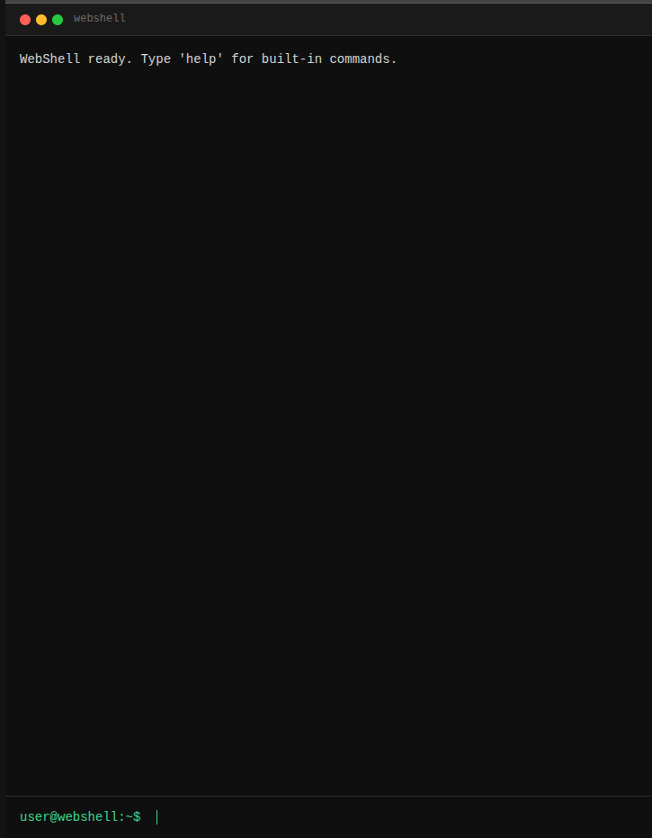

# WebShell

WebShell is a browser-based terminal frontend for executing shell commands on a remote host.
It provides a TUI-like interface directly in the browser — no SSH client, no VPN, no additional tooling required.
Useful for quick access to a containerized environment, a dev machine, or any host that is reachable via HTTP.

**Features**
- Full-screen terminal UI with macOS-style titlebar
- Command history navigation via `↑` / `↓` arrow keys
- Inline output — commands and results appear in sequence, like a real shell session
- Built-in commands: `clear`, `help`
- Commands with a non-zero exit code are highlighted as errors
- 30-second execution timeout with forced process termination
- Form-based login with BCrypt-hashed passwords (Spring Security)
- Runs as a single self-contained JAR or Docker container



## Dependencies
- Java 25
- Maven 3.9

## Users
Two users are pre-configured in `application.yml`:

| Username | Role  |
|----------|-------|
| `user`   | SHELL |
| `test`   | SHELL |

Passwords are stored as BCrypt hashes. To set your own passwords:
1. Generate a hash with `BCryptPasswordEncoder`
2. Replace the values for `userpassword` and `testpassword` in [application.yml](src/main/resources/application.yml)

## Build

```bash
mvn package
```

## Run

### Windows
```bat
java -jar target\webshell-0.1.2-SNAPSHOT.jar
```

### Linux
```bash
java -jar target/webshell-0.1.2-SNAPSHOT.jar
```

### Port
The default port is `8001`. Override with the `PORT` environment variable:

```bash
PORT=9000 java -jar target/webshell-0.1.2-SNAPSHOT.jar
```

## Docker Hub
https://hub.docker.com/r/wlanboy/webshell

## Docker build
```bash
docker build -t webshell:latest .
```

## Docker run
```bash
docker run --name webshell -d -p 8080:8001 -v /tmp:/tmp wlanboy/webshell:latest
```

Override port:
```bash
docker run --name webshell -d -p 9000:9000 -e PORT=9000 -v /tmp:/tmp wlanboy/webshell:latest
```

## Behavior

- Commands are executed in `/tmp` as working directory
- Commands that exceed **30 seconds** are killed and return a timeout message
- Commands with a non-zero exit code return **HTTP 422** — the output is shown as an error in the UI
- stderr is merged into stdout
